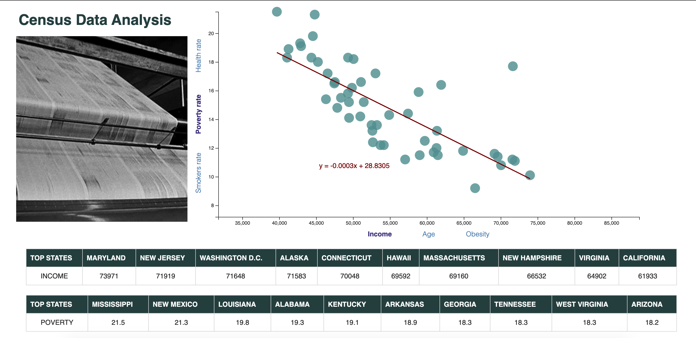

# D3-challenge
* Build an interactive dashboard to analyze Census Data

The data set is based on 2014 ACS 1-year estimates: [https://factfinder.census.gov/faces/nav/jsf/pages/searchresults.xhtml](https://factfinder.census.gov/faces/nav/jsf/pages/searchresults.xhtml)


[](http://commonmark.org)
[](http://hits.dwyl.com/OlegRyzhkov2020/d3-challenge)


## Dashboard



## Census Data Site


## Dataset Exploring

```JavaScript
// Retrieve data from the CSV file and execute everything below
d3.csv("data/data.csv").then(function(censusData, err) {
  if (err) throw err;

  // parse data
  censusData.forEach(function(data) {
    data.poverty = +data.poverty;
    data.smokes = +data.smokes;
    data.health = +data.healthcare;
    data.income = +data.income;
    data.age = +data.age;
    data.obesity = +data.obesity;
    data.state = data.state;
  });

```

## D3 Library

```JavaScript
// Create an SVG wrapper, append an SVG group that will hold our chart,
// and shift the latter by left and top margins.
var svg = d3
  .select(".chart")
  .append("svg")
  .attr("width", svgWidth)
  .attr("height", svgHeight);

// Append an SVG group
var chartGroup = svg.append("g")
  .attr("transform", `translate(${margin.left}, ${margin.top})`);

// Initial Params
var chosenXAxis = "income";
var chosenYAxis = "poverty";

// function used for updating x-scale var upon click on axis label
function xScale(censusData, chosenXAxis) {
  // create scales
  var xLinearScale = d3.scaleLinear()
    .domain([d3.min(censusData, d => d[chosenXAxis]) * 0.8,
      d3.max(censusData, d => d[chosenXAxis]) * 1.2
    ])
    .range([0, width]);

  return xLinearScale;

}
// function used for updating y-scale var upon click on axis label
function yScale(censusData, chosenYAxis) {
  // create scales
  var yLinearScale = d3.scaleLinear()
  .domain([d3.min(censusData, d => d[chosenYAxis])-2, d3.max(censusData, d => d[chosenYAxis])])
  .range([height, 0]);

  return yLinearScale;

}
```

## Regression

```JavaScript
function regr_equation(XaxisData, Yaxisdata) {
    var ReduceAddition = function(prev, cur) { return prev + cur; };

    // finding the mean of Xaxis and Yaxis data
    var xBar = XaxisData.reduce(ReduceAddition) * 1.0 / XaxisData.length;
    var yBar = Yaxisdata.reduce(ReduceAddition) * 1.0 / Yaxisdata.length;

    var SquareXX = XaxisData.map(function(d) { return Math.pow(d - xBar, 2); })
      .reduce(ReduceAddition);

    var ssYY = Yaxisdata.map(function(d) { return Math.pow(d - yBar, 2); })
      .reduce(ReduceAddition);

    var MeanDiffXY = XaxisData.map(function(d, i) { return (d - xBar) * (Yaxisdata[i] - yBar); })
      .reduce(ReduceAddition);

    var slope = MeanDiffXY / SquareXX;
    var intercept = yBar - (xBar * slope);

    return [slope, intercept];
  }
```

## Contacts
[Find Me on
LinkedIn](https://www.linkedin.com/in/oleg-n-ryzhkov/)
